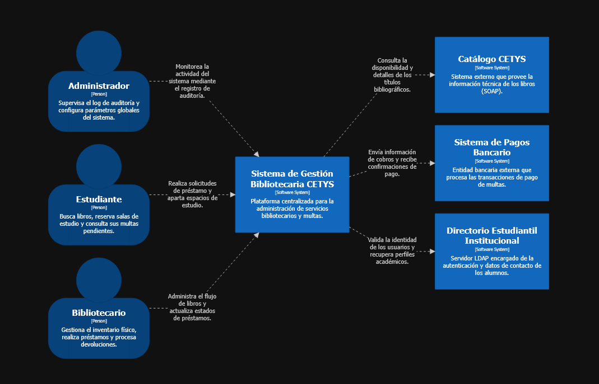

workspace "Sistema de Gestión Bibliotecaria CETYS" "Gestión de préstamos, salas y multas" {

    model {
        # Actores humanos
        estudiante = person "Estudiante" "Busca libros, reserva salas de estudio y consulta sus multas pendientes."
        bibliotecario = person "Bibliotecario" "Gestiona el inventario físico, realiza préstamos y procesa devoluciones."
        admin = person "Administrador" "Supervisa el log de auditoría y configura parámetros globales del sistema."

        # El sistema central
        sgbc = softwareSystem "Sistema de Gestión Bibliotecaria CETYS" "Plataforma centralizada para la administración de servicios bibliotecarios y multas."

        # Sistemas externos
        catalogo = softwareSystem "Catálogo CETYS" "Sistema externo que provee la información técnica de los libros (SOAP)."
        pagos = softwareSystem "Sistema de Pagos Bancario" "Entidad bancaria externa que procesa las transacciones de pago de multas."
        directorio = softwareSystem "Directorio Estudiantil Institucional" "Servidor LDAP encargado de la autenticación y datos de contacto de los alumnos."

        # Relaciones de personas con el sistema
        estudiante -> sgbc "Realiza solicitudes de préstamo y aparta espacios de estudio."
        bibliotecario -> sgbc "Administra el flujo de libros y actualiza estados de préstamos."
        admin -> sgbc "Monitorea la actividad del sistema mediante el registro de auditoría."

        # Relaciones del sistema con entidades externas
        sgbc -> catalogo "Consulta la disponibilidad y detalles de los títulos bibliográficos."
        sgbc -> pagos "Envía información de cobros y recibe confirmaciones de pago."
        sgbc -> directorio "Valida la identidad de los usuarios y recupera perfiles académicos."
    }

    views {
        systemContext sgbc "Contexto" "Diagrama de contexto del Sistema de Gestión Bibliotecaria CETYS" {
            include *
            autoLayout lr
        }

        styles {
            element "Person" {
                shape person
                background #08427b
                color #ffffff
            }
            element "Software System" {
                background #1168bd
                color #ffffff
            }
        }
    }

}

