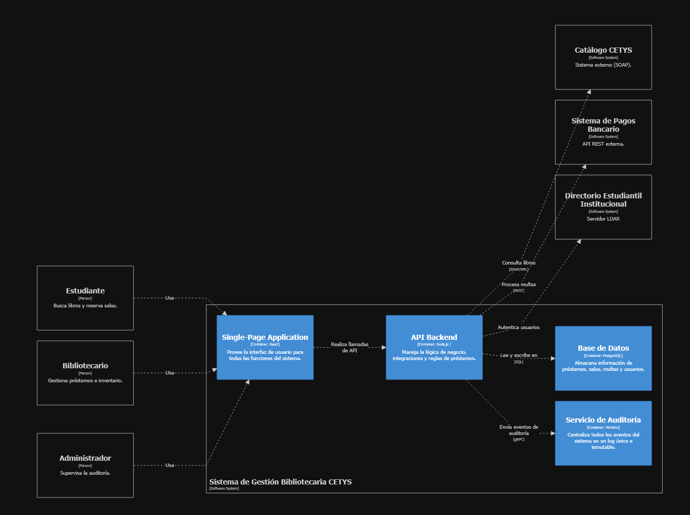

workspace "Sistema de Gestión Bibliotecaria CETYS" "Nivel 2: Contenedores" {

    model {
        estudiante = person "Estudiante" "Busca libros y reserva salas."
        bibliotecario = person "Bibliotecario" "Gestiona préstamos e inventario."
        admin = person "Administrador" "Supervisa la auditoría."

        catalogo = softwareSystem "Catálogo CETYS" "Sistema externo (SOAP)."
        pagos = softwareSystem "Sistema de Pagos Bancario" "API REST externa."
        directorio = softwareSystem "Directorio Estudiantil Institucional" "Servidor LDAP."

        sgbc = softwareSystem "Sistema de Gestión Bibliotecaria CETYS" {
            webApp = container "Single-Page Application" "Provee la interfaz de usuario para todas las funciones del sistema." "React"
            apiApp = container "API Backend" "Maneja la lógica de negocio, integraciones y reglas de préstamos." "Node.js "
            database = container "Base de Datos" "Almacena información de préstamos, salas, multas y usuarios." "PostgreSQL"
            auditService = container "Servicio de Auditoría" "Centraliza todos los eventos del sistema en un log único e inmutable." "Winston"
        }

        # Conexiones de usuarios
        estudiante -> webApp "Usa"
        bibliotecario -> webApp "Usa"
        admin -> webApp "Usa"

        # Conexiones internas
        webApp -> apiApp "Realiza llamadas de API"
        apiApp -> database "Lee y escribe en" "SQL"
        apiApp -> auditService "Envía eventos de auditoría" "gRPC"

        # Conexiones externas
        apiApp -> catalogo "Consulta libros" "SOAP/XML"
        apiApp -> pagos "Procesa multas" "REST"
        apiApp -> directorio "Autentica usuarios"
    }

    views {
        container sgbc "Contenedores" "Diagrama de contenedores del sistema" {
            include *
            autoLayout lr
        }

        styles {
            element "Container" {
                background #438dd5
                color #ffffff
            }
            element "Database" {
                shape cylinder
            }
        }
    }

}

