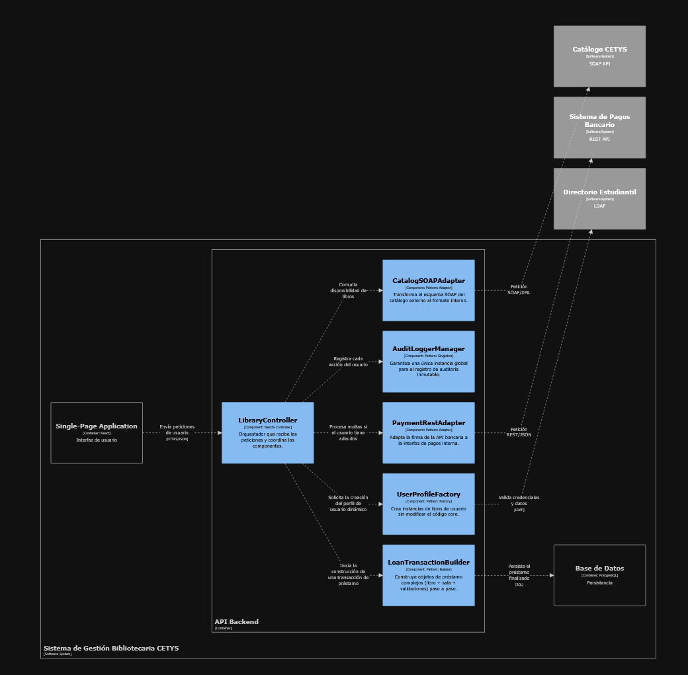

workspace "Sistema de Gestión Bibliotecaria CETYS" "Nivel 3: Componentes" {

    model {
        # Referencias externas
        catalogo = softwareSystem "Catálogo CETYS" "SOAP API" "External"
        pagos = softwareSystem "Sistema de Pagos Bancario" "REST API" "External"
        directorio = softwareSystem "Directorio Estudiantil" "LDAP" "External"

        sgbc = softwareSystem "Sistema de Gestión Bibliotecaria CETYS" {
            webApp = container "Single-Page Application" "Interfaz de usuario" "React"
            database = container "Base de Datos" "Persistencia" "PostgreSQL"

            apiApp = container "API Backend" "Maneja la lógica de negocio" "Node.js / TypeScript" {

                # 1. Factory Pattern: Extensibilidad de usuarios (Posgrado, externos, etc.)
                userFactory = component "UserProfileFactory" "Crea instancias de tipos de usuario sin modificar el código core." "Pattern: Factory"

                # 2. Singleton Pattern: Log de auditoría centralizado
                auditManager = component "AuditLoggerManager" "Garantiza una única instancia global para el registro de auditoría inmutable." "Pattern: Singleton"

                # 3. Adapter Pattern: Integración con sistemas externos heterogéneos
                catalogAdapter = component "CatalogSOAPAdapter" "Transforma el esquema SOAP del catálogo externo al formato interno." "Pattern: Adapter"
                paymentAdapter = component "PaymentRestAdapter" "Adapta la firma de la API bancaria a la interfaz de pagos interna." "Pattern: Adapter"

                # 4. Builder Pattern: Construcción de préstamos/reservas complejas
                loanBuilder = component "LoanTransactionBuilder" "Construye objetos de préstamo complejos (libro + sala + validaciones) paso a paso." "Pattern: Builder"

                # Componente de Control
                mainController = component "LibraryController" "Orquestador que recibe las peticiones y coordina los componentes." "NestJS Controller"
            }
        }

        # Relaciones de la WebApp al API
        webApp -> mainController "Envía peticiones de usuario" "HTTPS/JSON"

        # Flujo interno del API
        mainController -> auditManager "Registra cada acción del usuario"
        mainController -> userFactory "Solicita la creación del perfil de usuario dinámico"
        mainController -> catalogAdapter "Consulta disponibilidad de libros"
        mainController -> loanBuilder "Inicia la construcción de una transacción de préstamo"
        mainController -> paymentAdapter "Procesa multas si el usuario tiene adeudos"

        loanBuilder -> database "Persiste el préstamo finalizado" "SQL"
        userFactory -> directorio "Valida credenciales y datos" "LDAP"

        # Relaciones a sistemas externos
        catalogAdapter -> catalogo "Petición SOAP/XML"
        paymentAdapter -> pagos "Petición REST/JSON"
    }

    views {
        component apiApp "Componentes" "Diagrama de componentes del API Backend" {
            include *
            autoLayout lr
        }

        styles {
            element "Component" {
                background #85bbf0
                color #000000
            }
            element "External" {
                background #999999
                color #ffffff
            }
        }
    }

}

